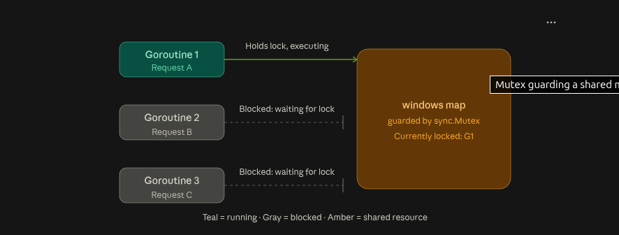

# Token Bucket Rate Limiter

A standalone Go + Echo rate limiting service, built to learn what breaks when rate limiting moves from a single instance to multiple replicas behind a load balancer, and how atomic Redis Lua scripting fixes it.

Public contract: `POST /check` with a client key, returns `{allowed: bool, remaining: int}`.

## Architecture at a glance

- **Redis** — shared state store every rate limiter instance eventually hits.
- **Nginx** — load balancer, spreads requests across N replicas.
- **Algorithm** — token bucket (allows burst up to capacity, smooths to a steady average rate), made atomic via a Redis Lua script.

## Build phases

### Phase 1 — Docker infrastructure ✅ done

`docker-compose.yml` defines two services, `redis` (`redis:7-alpine`) and `nginx` (`nginx:alpine`), joined to an explicit custom bridge network (`rl-network`) so containers can resolve each other by service name once more services join later. Nginx bind-mounts a local `nginx.conf` over the image's default config; for now that config is just a `/healthz` stub proving the container boots correctly — the real `upstream`/`proxy_pass` load-balancing config comes in Phase 5.

Verified: `curl http://localhost:8080/healthz` → `nginx up`, `docker exec rl_redis redis-cli ping` → `PONG`.

### Phase 2 — Rate limiter service skeleton (in progress)

Single instance, in-memory, fixed-window counter. Goal is proving the HTTP shape — Echo, the `/check` endpoint, the `App` struct wiring — works, before Redis or the real token-bucket algorithm enter the picture.

### Phase 3 — Naive Redis integration (planned)

Read-then-write against Redis, deliberately not atomic. Load test it to trigger the check-then-act race condition and actually watch it happen.

### Phase 4 — Redis Lua script fix (planned)

Token bucket algorithm executed atomically inside a Lua script, replacing the naive check-then-act from Phase 3. Lua scripts run single-threaded on Redis with no interleaving — that's what closes the race.

### Phase 5 — Multi-instance behind nginx (planned)

Multiple rate limiter replicas wired into `docker-compose`, behind nginx. Load test across all of them to prove the limit holds globally, not per-instance.

### Phase 6 — Failure modes & observability (planned)

What happens when Redis is slow or down — fail open vs fail closed — plus metrics on allow/deny counts.

### Phase 7 — Dashboards & log correlation (planned)

Grafana, Kibana, and Uptime Kuma integration. Logging via `logrus.WithContext` so trace/span context flows into log fields and dashboards can correlate a log line back to a specific request's trace — request latency and per-function timing, end to end.

### MUTEXES

- A mutext (mutual exclusion lock) guarantees that only one goroutine can be inside a protected section of code at a time.
- Everyone else who tries to enter has to wait their turn.

### K6

- open source load testing tool, where you write test scripts in JS/TS to simulate real traffic against API
- Fire a burst of concurrent requests at your rate limiter and watch what breaks.

## Naive-redis

- The race condition does not exist in redis, redis itself is single threaded, and executes each command atomically, with no interleaving.
- Race condition exists entirely in the code; the gap btn GET finishing and SET starting is where another goroutine's GET can sneak in.
- Redis did what it was asked; we just asked it two separate, uncoordinated things instead of one atomic thing.
- We fix this by introducing **LUA** which makes our check-and-write into a single atomic value, so there's no gap left to race into.

- If requests for the same key arrived on at a time **(ideal world/scenario)** spaced out even slightly, this bug would never show up - each pair GET/SET would complete cleanly before the next one started, and the limiter would work correctly.
- It only breaks when multiple requests check then write; windows windows overlap in time
- This bug is dangerous in prod; it can pass every normal test and manual check, and only reveals itself the moment real concurrent traffic hits.
